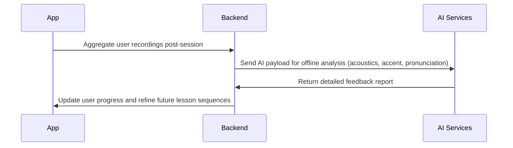
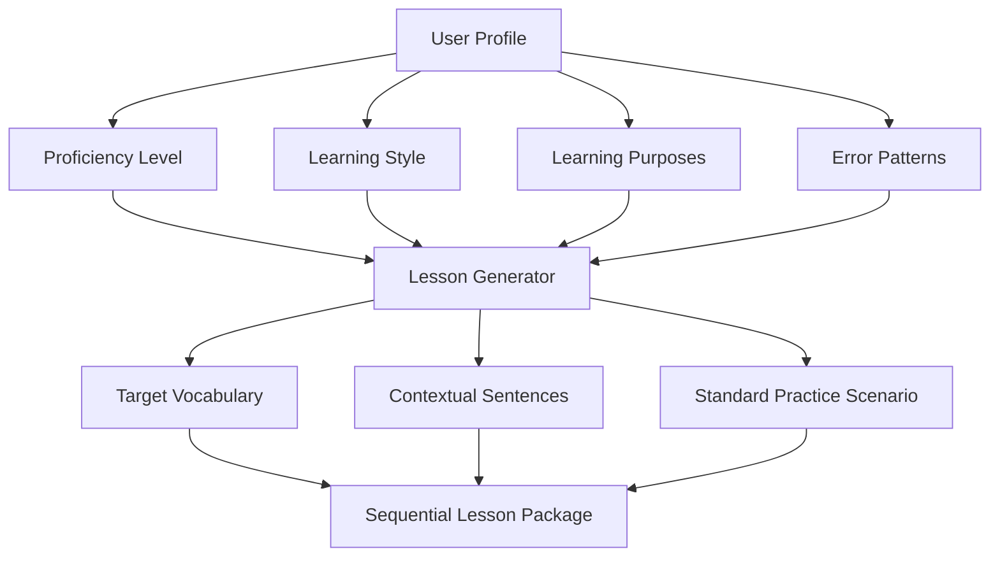

# App Architecture Documentation

This document outlines the high-level architecture for an AI-driven voice lesson app. In this app, users log in and, if they are first-time users, complete an initial evaluation that includes a prompt for their learning purposes. AI processes this assessment offline and generates a structured, predefined, sequential lesson package. **Each lesson follows a fixed format—identical to the process used by the Natulang app, but with the key differentiator that our lessons are AI-generated specifically for each user's needs and proficiency level.**

For example, a lesson might be:
- **Prompt:** "How do you say: 'I would like to order?'"
- **Expected Response (Model Answer):** "I would like to order"

During lessons, the browser's inbuilt voice recognition captures the user's voice response and compares it against the preset correct answer. **It is critical to note that the prompts are expecting the user to say exactly what is defined—no additional words or variations are accepted.** User recordings are stored for offline analysis (acoustics, accent, pronunciation) which are later used for adaptive learning—enabling the AI to refine future lesson sequences based on detailed vocal performance.

> **Note:** For this implementation, our lesson flow structure is **exactly the same as the Natulang app**. The significant value we add is that lessons are adaptively generated by AI based on each user's specific needs, learning goals, and proficiency level.

---

## Core User Flow Implementation

### Authentication & Initial Evaluation

For first-time users:
- **Login:** The app verifies if the user already exists.
- **Initial Assessment:** If new, the app will:
  - Conduct an evaluation to determine the user's language proficiency.
  - **Prompt the user for their learning purposes** (e.g., travel, business, cultural exchange) using the browser's inbuilt voice recognition.
  - Submit the voice responses along with learning purpose data.
  - AI processes this information offline and generates a **predefined, sequential lesson package** (in the exact same fixed structure as in the Natulang app) tailored to the user's profile.
  - The proficiency profile and generated lesson sequence are stored in the backend.

For returning users:
- **Resuming Lessons:** The app retrieves the stored lesson sequence and the user's progress so that the user can continue with the sequential lessons.

#### User Flow Diagram

```mermaid
sequenceDiagram
    participant U as User
    participant A as App
    participant B as Backend
    participant AI as AI Services
    
    U->>A: Launches app
    A->>B: Check user status
    alt New User
        B-->>A: Flag new user
        A->>AI: Request initial assessment & learning purpose prompt
        AI->>A: Return evaluation questions and learning purpose prompt
        A->>U: Conduct voice assessment (using inbuilt browser voice recognition)
        U->>A: Submit voice responses with learning purposes
        A->>B: Store proficiency profile and learning purposes
        A->>AI: Request lesson sequence generation (offline)
        AI->>B: Store generated lesson sequence (predefined, sequential, Natulang-style)
    else Returning User
        B->>A: Retrieve stored lesson sequence and progress
    end
    
    loop Lesson Session
        A->>U: Present next lesson step (pre-generated, fixed structure)
        U->>A: Provide voice response (captured via browser)
        A: Compare response with predefined correct answer
        A->>B: Record and store user voice response for later analysis
    end
```

---

## Post-Session Voice Analysis & Adaptive Learning

After the lesson session, the app aggregates stored user recordings and sends an AI payload for offline analysis. This analysis evaluates:
- Acoustics
- Accent
- Pronunciation

The results are fed back into the adaptive learning system so that **future lesson packages can be adjusted** based on the user's actual performance. **This adaptive learning capability is our key differentiator - lessons evolve based on the user's performance and needs.**



---

## AI-Driven Lesson System Overview

The core of the app is its voice lesson engine. AI is used **pre-session** to generate a sequential lesson package, and it is **not invoked in real time during the lesson**. Key functions include:

1. **Assessment Analysis:**  
   - Converts voice input (captured via the browser's inbuilt voice recognition) to text.
   - Evaluates pronunciation and language proficiency.
   - Integrates learning purpose information from the initial assessment.

2. **Pre-Session Lesson Generation:**  
   - AI creates a fixed, sequential sequence of lessons based on the evaluation data.
   - **Important:** The lesson flow is implemented **exactly as in the Natulang app**. This means that every lesson is generated with the same predefined, sequential structure.
   - **What Makes Us Different:** While we use the same lesson structure, our content is AI-generated specifically for each user's needs, goals, and proficiency level.
   - **Example Lesson Structure:**  
     - *Prompt:* "How do you say: 'I would like to order?'"  
     - *Model Answer:* "I would like to order"
   - The complete lesson sequence is stored for later delivery.

3. **During-Lesson Operation:**  
   - **Voice Response Capture:**  
     - The browser's built-in voice recognition captures the user's spoken response.
     - **Important:** The prompt expects the user to say exactly the predefined answer with no extra words or variations. The system strictly compares the input to the expected response.
   - **Recording Storage:**  
     - User responses are stored locally and, after the session, aggregated for offline analysis.
     - Offline analysis results help adjust future lessons through adaptive learning.

---

## AI Content Generation Workflow

This flowchart illustrates how AI utilizes the user's profile data (including learning purposes) to generate a sequential lesson package with the fixed lesson structure (as seen in the Natulang app):



### AI Model Pipeline (Pre-Session)

The high-level AI pipeline employed to generate the lesson sequence offline is as follows:

```mermaid
graph LR
    A[Voice Input (Assessment)] --> B[Speech-to-Text]
    B --> C[Language Processor]
    C --> D[Proficiency Analyzer]
    D --> E[Lesson Planner (Generates Sequential Lessons)]
```

---

## Technical Considerations

1. **AI Model Architecture (Pre-Session & Offline Analysis)**
   - **Multi-model pipeline:**  
     - **Speech-to-text conversion:** Utilizes the browser's inbuilt voice recognition (Web Speech API).
     - **Natural Language Processing:** Analyzes grammar, vocabulary, and pronunciation.
     - **Pre-session Lesson Generation:** AI creates a predefined, sequential lesson package with a fixed structure – **identical to the Natulang app flow** (e.g., "How do you say: 'I would like to order?'" followed by "I would like to order a croissant").
     - **Offline Analysis for Adaptive Learning:** User recordings are analyzed for acoustics, accent, and pronunciation. The feedback from this analysis informs adjustments in future lesson packages.

2. **Lesson Structure & Content Management**
   - **Predefined Lesson Package:**  
     Lessons are generated as a sequential package with a fixed structure. For this release, we are adopting the **Natulang-style lesson flow**. The content is stored in JSON format and includes:
     - An introduction prompt (e.g., "How do you say: 'I would like to order?'").
     - A model answer (e.g., "I would like to order a croissant").
     - Additional practice or challenge components as needed.
   
   ***Example JSON Structure:***
   ```json
   {
     "lesson_id": "AI_GEN_023",
     "focus_area": "food_ordering",
     "target_skills": ["vocabulary", "present_tense"],
     "sequence": [
       {
         "step": 1,
         "type": "prompt",
         "content": "to start say 'ready to start'"
       },
       {
         "step": 2,
         "type": "user_answer",
         "content": "ready to start"
       },
       {
         "step": 3,
         "type": "new_word",
         "content": "Larm machen",
         "translation": "make a noise"
       },
       {
         "step": 4,
         "type": "user_answer",
         "content": "Larm machen"
       },
       {
         "step": 5,
         "type": "practice",
         "content": "Larm machen"
       },
       {
         "step": 6,
         "type": "user_answer",
         "content": "Larm machen"
       },
       {
         "step": 7,
         "type": "new_word",
         "content": "mach keinen larm",
         "translation": "don't make a noise"
       },
       {
         "step": 8,
         "type": "user_answer",
         "content": "mach keinen larm"
       },
       {
         "step": 9,
         "type": "model_answer",
         "content": "good"
       },
       {
         "step": 10,
         "type": "new_word",
         "content": "ich arbeite",
         "translation": "I work"
       },
       {
         "step": 11,
         "type": "user_answer",
         "content": "ich arbeite"
       },
       {
         "step": 12,
         "type": "prompt",
         "content": "how to say dont make a noise"
       },
       {
         "step": 13,
         "type": "user_answer",
         "content": "mach keinen larm"
       },
       {
         "step": 15,
         "type": "prompt",
         "content": "how to say because"
       },
       {
         "step": 16,
         "type": "user_answer",
         "content": "weil"
       },
       {
         "step": 17,
         "type": "prompt",
         "content": "how to say 'dont make a noise because I am working'"
       },
       {
         "step": 18,
         "type": "user_answer",
         "content": "mach keinen larm weil ich arbeite"
       }
     ]
   }
   ```
   **Note:** Each prompt expects the user to say exactly what is specified. Any deviation or additional words will result in a mismatch with the expected answer.

3. **Lesson Session Operation**
   - **Voice Recognition:**  
     - Uses the browser's inbuilt voice recognition solely for capturing voice responses.
     - Compares the user's input to the pre-established correct answer (which, for example, would be "I would like to order a croissant"). The matching is strict—only an exact match is accepted.
   - **Recording Collection:**  
     - User responses are stored locally and, after the session, aggregated for offline analysis.
     - Offline analysis results help adjust future lessons through adaptive learning.

4. **Key AI Components (Offline Analysis & Adaptive Learning)**
   - **Speech Recognition (During Lesson):**  
     Uses the browser's inbuilt voice recognition for capturing responses.
   - **Offline Voice Analysis:**  
     AI services analyze user recordings for:
       - Acoustic features
       - Accent characteristics
       - Pronunciation accuracy
   - **Content & Adaptive Lesson Generation:**  
     Fine-tuned language models generate the fixed, sequential lessons following the Natulang approach. Offline analysis feedback guides adaptive learning by influencing subsequent lesson content.
   - **Progress Tracking & Adaptive Feedback:**  
     Updates the user's progress profile and refines future lessons based on the results of offline recording analysis.

---

## What Makes Our Application Different

While we mirror the Natulang app's lesson flow structure, our key differentiators are:

1. **AI-Generated Personalized Content:** Lessons are not pre-scripted but dynamically generated based on each user's:
   - Proficiency level
   - Learning goals and purposes
   - Specific needs identified during assessment
   - Native language and potential interference patterns

2. **True Adaptive Learning:** The system evolves with the user by:
   - Analyzing detailed pronunciation patterns
   - Identifying recurring errors
   - Adjusting future lessons to address specific challenges
   - Progressing at a pace appropriate for the individual learner

3. **Targeted Skill Development:** Our AI identifies and focuses on areas where the user needs the most improvement, creating a more efficient learning path than general-purpose lessons.

## Data Collection & Adaptive Learning

### Data Collection
1. **User Responses:**  
   - Transcribed text and audio recordings of user voice responses.
2. **Performance Metrics:**  
   - Accuracy, pronunciation, and error patterns.
3. **Lesson Progress:**  
   - Completed lessons, time taken, and number of attempts.
4. **Error Patterns:**  
   - Common mistakes and areas of difficulty.

### Adaptive Learning
1. **Lesson Generation:**  
   - AI generates personalized lessons based on user data.
2. **Progress Adaptation:**  
   - Adjusts lesson difficulty and focus based on performance metrics.
3. **Offline Analysis:**  
   - Analyzes audio recordings for acoustics, accent, and pronunciation.

1. Data Collection
What Data to Collect
User Responses:
Transcribed text of user voice responses.
Audio recordings of user responses (for offline analysis).
2. Performance Metrics:
Accuracy of responses (e.g., exact match with model answers).
Pronunciation, accent, and acoustic features (analyzed offline).
3. Lesson Progress:
Which lessons the user has completed.
Time taken to complete each lesson.
Number of attempts per lesson.
Error Patterns:
Common mistakes (e.g., mispronunciations, incorrect vocabulary).
Areas where the user struggles (e.g., specific grammar rules or vocabulary).
Learning Goals:
User's stated learning purposes (e.g., travel, business).
Proficiency level (from initial assessment).
---
How to Collect Data
During Lessons:
Use the browser's Web Speech API to capture user voice responses.
Transcribe the responses and compare them to the model answers.
Store the transcribed text and audio recordings in the database.
2. Post-Session Analysis:
Aggregate user recordings and send them to an AI service for offline analysis.
Analyze acoustics, accent, and pronunciation to identify areas for improvement.
3. User Progress Tracking:
Track which lessons the user has completed and their performance metrics.
Store this data in the database for future reference.
---
2. Data Storage
Where to Store Data
1. Database (PostgreSQL):
Store user profiles, lesson progress, and performance metrics.
Example tables:
users: User profiles and authentication data.
lessons: Generated lesson sequences.
user_responses: Transcribed text and audio recordings.
performance_metrics: Accuracy, pronunciation, and error patterns.
2. File Storage (Optional):
Store audio recordings in a file storage system (e.g., AWS S3, Supabase Storage) if the database is not suitable for large files.
---
3. AI-Driven Lesson Adaptation
How AI Uses the Data
1. Lesson Generation:
Use the user's proficiency level, learning goals, and error patterns to generate personalized lesson sequences.
Example: If a user struggles with pronunciation, generate lessons focused on phonetics.
Progress Adaptation:
Analyze performance metrics to adjust the difficulty and focus of future lessons.
Example: If a user consistently makes mistakes with a specific grammar rule, generate additional practice exercises for that rule.
3. Offline Analysis:
Use AI to analyze audio recordings for acoustics, accent, and pronunciation.
Feed the results back into the lesson generation system to refine future lessons.
---