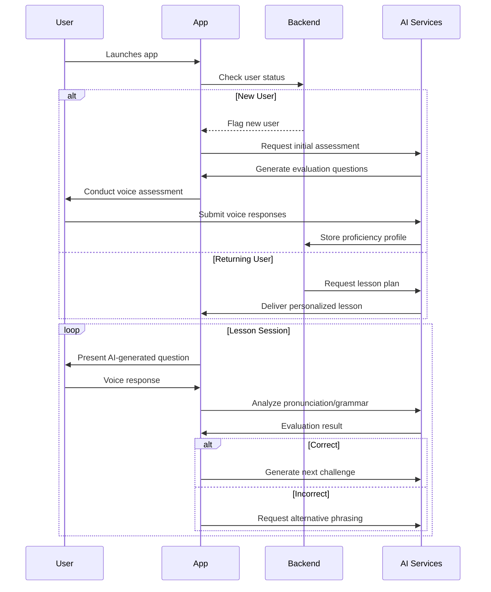
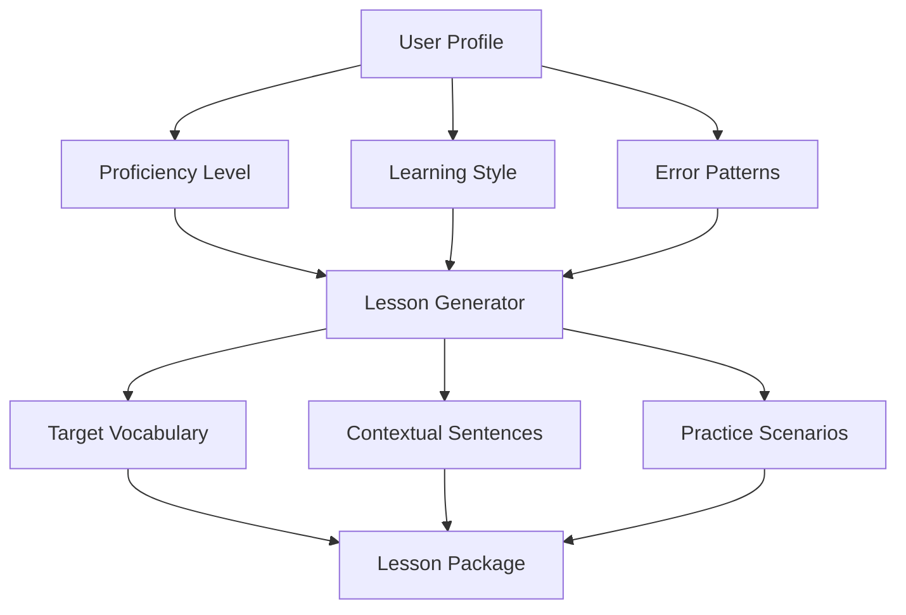
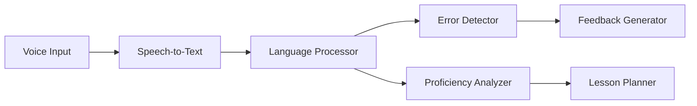

# App Architecture Documentation

This document outlines the high-level architecture for an AI-driven voice lesson app where the user logs in, completes an initial evaluation (if new), and then engages in a series of voice-based lessons. AI is leveraged both for generating evaluation questions and for creating dynamic, personalized lesson content.

---

## Core User Flow Implementation

### Authentication & Initial Evaluation

For first-time users:
- **Login:** The app verifies if the user exists.
- **Evaluation:** If new, an AI service is invoked to generate an initial assessment. The user responds with voice input which is analyzed (e.g., for pronunciation and vocabulary), and then a proficiency profile is stored.

For returning users:
- **Resuming Lessons:** The app retrieves the user’s progress and requests a tailored lesson plan from the AI services.

#### User Flow Diagram



---

## AI-Driven Lesson System Overview

The core of the app is its voice lesson engine which is driven by AI. This engine handles three main tasks:

1. **Assessment Analysis:**  
   - Converts voice to text.
   - Scores pronunciation and evaluates responses.
   - Determines the user’s proficiency level.

2. **Dynamic Lesson Generation:**  
   - Uses the user profile (proficiency level, learning style, error patterns) to generate lessons on the fly.
   - Introduces new words, phrases, and sentences contextually.
   - Creates follow-up challenges based on real-time performance.

3. **Real-time Speech Evaluation:**  
   - Provides immediate feedback on voice inputs.
   - Detects pronunciation errors.
   - Requests alternative phrasings or additional attempts as needed.

### AI Content Generation Workflow

This flowchart illustrates how AI takes into account the user’s profile to generate a customized lesson package:



### AI Model Pipeline

Below is the high-level view of the AI components and how data flows through them:



---

## Technical Considerations

1. **AI Model Architecture**
   - **Multi-model pipeline:**  
     - Speech-to-text conversion.
     - Natural Language Processing for grammar and vocabulary.
     - Sentiment and error detection for real-time feedback.
  
2. **Content Management**
   - **Lesson Structure (AI-generated):**  
     The AI generates lesson content dynamically represented (e.g., in JSON) with components such as:
     - Introduction to a target word or phrase.
     - Variations and practice sentences.
     - Role-play and situational challenges.
   
   ***Example JSON Structure:***
   ```json
   {
     "lesson_id": "AI_GEN_023",
     "focus_area": "food_ordering",
     "target_skills": ["vocabulary", "present_tense"],
     "components": {
       "introduction": {
         "ai_generated": true,
         "content": "Today we'll learn restaurant phrases..."
       },
       "target_phrases": [
         {
           "base_phrase": "I would like to order",
           "variations": [
             "Could I get...",
             "I'll have..."
           ]
         }
       ],
       "practice_scenarios": [
         {
           "type": "role_play",
           "context": "Busy cafe with noisy background",
           "prompt": "Ask for a coffee and croissant"
         }
       ]
     }
   }
   ```

3. **Implementation Strategy**
   - **Phase 1: Baseline AI Models**
     - Utilize pre-trained speech recognition and language analysis models.
   - **Phase 2: Custom Model Training**
     - Train models on domain-specific vocabulary and accent adaptation.
   - **Phase 3: Adaptive Learning**
     - Implement real-time content adjustment based on ongoing user performance.
  
4. **Key AI Components**

   | Component               | Technology Options              | Description                              |
   |-------------------------|----------------------------------|------------------------------------------|
   | Speech Recognition      | Whisper, Google Speech-to-Text   | Real-time voice processing               |
   | Language Analysis       | BERT, GPT-4                     | Contextual understanding                 |
   | Pronunciation Scoring   | OpenSmile, Librosa              | Acoustic feature analysis                |
   | Content Generation      | Fine-tuned LLMs                 | Dynamic lesson content creation          |
   | Progress Prediction     | TensorFlow/PyTorch              | Modeling user's learning trajectory      |

---

This high-level documentation provides an overview of the system architecture and AI integration for your voice lesson app. It sets a strong foundation for both the development and future expansion of the app's capabilities.

*For any further expansion (e.g., API specifications, privacy/security details, detailed voice processing pipelines), feel free to request additional sections.*