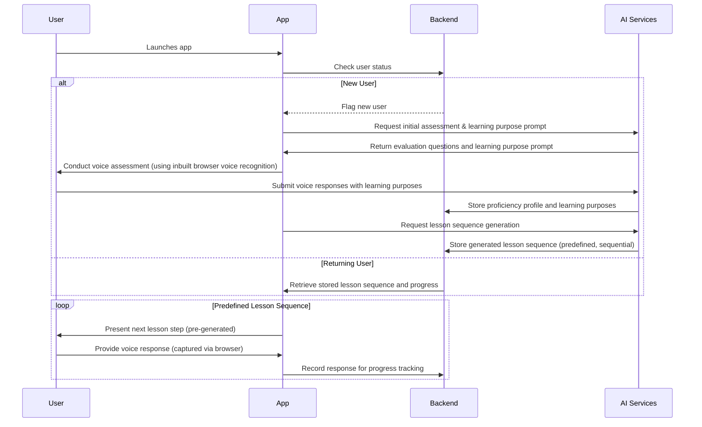
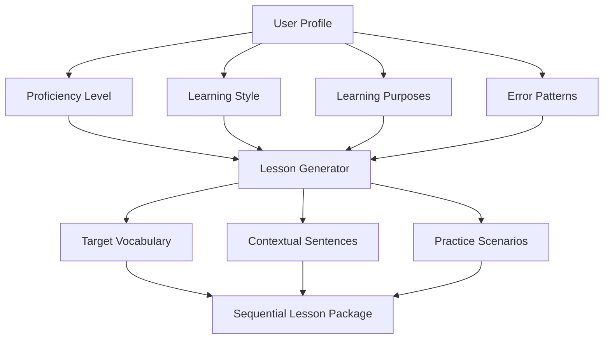

# App Architecture Documentation

This document outlines the high-level architecture for an AI-driven voice lesson app. In this app, the user logs in and, if they are a first-time user, completes an initial evaluation that includes a prompt for their learning purposes. AI leverages this information to generate a structured, predefined sequence of lessons. Users then progress through these lessons step-by-step. Real-time voice recognition (via the browser's inbuilt capabilities) is used solely to capture voice responses, not to interact with AI during the session.

---

## Core User Flow Implementation

### Authentication & Initial Evaluation

For first-time users:
- **Login:** The app verifies whether the user exists.
- **Initial Assessment:** If new, the app will:
  - Conduct an evaluation to determine the user's language proficiency.
  - **Prompt the user for their learning purposes** (e.g., travel, business, cultural exchange) using the browser's inbuilt voice recognition.
  - Submit the voice responses along with learning purpose information.
  - AI processes this data and **generates a predefined, sequential lesson package** tailored to the user's profile.
  - The proficiency profile and generated lesson sequence are stored in the backend.

For returning users:
- **Resuming Lessons:** The app retrieves the stored lesson sequence and user progress so that the user can continue through the sequential lessons.

#### User Flow Diagram



---

## AI-Driven Lesson System Overview

The core of the app is its voice lesson engine, which leverages AI to generate a **sequential lesson package** before the lesson session begins. Key functions include:

1. **Assessment Analysis:**  
   - Converts voice input (captured via the browser's inbuilt voice recognition) to text.
   - Evaluates pronunciation and language proficiency.
   - Integrates learning purpose information provided during the initial assessment.

2. **Pre-Session Lesson Generation:**  
   - Using the evaluation data, AI generates a structured, predefined sequence of lessons.
   - Each lesson is organized as a series of sequential steps, such as:
     - Introducing a new word or concept.
     - Presenting practice sentences or questions.
     - Fixed challenges formulated by AI.
   - The resulting lesson sequence is stored for later delivery, ensuring a consistent and linear learning experience.

3. **Voice Response Capture:**  
   - As the user progresses through the lesson, their voice responses are captured using the browser's inbuilt voice recognition.
   - Responses are recorded for progress tracking and offline analysis, but no real-time AI interaction occurs during the session.

### AI Content Generation Workflow

This flowchart illustrates how AI leverages user profile data (including learning purposes) to generate a sequential lesson package:



### AI Model Pipeline

The high-level AI pipeline processes the initial assessment offline to generate the lesson sequence:

```mermaid
graph LR
    A[Voice Input (Browser's Voice Recognition)] --> B[Speech-to-Text]
    B --> C[Language Processor]
    C --> D[Error Detector]
    D --> E[Feedback Generator]
    C --> F[Proficiency Analyzer]
    F --> G[Lesson Planner (Generates Sequential Lessons)]
```

---

## Technical Considerations

1. **AI Model Architecture**
   - **Multi-model pipeline:**
     - **Speech-to-text conversion:** Utilizes the browser's inbuilt voice recognition (Web Speech API).
     - **Natural Language Processing:** Analyzes grammar, vocabulary, and pronunciation.
     - **Pre-session Lesson Generation:** AI generates a predefined lesson sequence based on initial assessment data.

2. **Content Management**
   - **Lesson Structure (AI-generated):**  
     Lessons are generated as a sequential package. Each lesson step is represented in a JSON format containing:
     - An introduction to a target word or concept.
     - Practice exercises or questions.
     - A fixed progression to the next lesson step.
   
   ***Example JSON Structure:***
   ```json
   {
     "lesson_id": "AI_GEN_023",
     "focus_area": "food_ordering",
     "target_skills": ["vocabulary", "present_tense"],
     "sequence": [
       {
         "step": 1,
         "type": "introduction",
         "content": "Introducing the phrase 'I would like to order'"
       },
       {
         "step": 2,
         "type": "practice",
         "content": "Practice saying: 'I would like to order a coffee'"
       },
       {
         "step": 3,
         "type": "challenge",
         "content": "How do you ask for a croissant in a restaurant?"
       }
     ]
   }
   ```

3. **Implementation Strategy**
   - **Phase 1: Baseline AI Models**
     - Leverage pre-trained language and speech recognition models using the browser's built-in capabilities.
   - **Phase 2: Custom AI Training**
     - Train on domain-specific vocabulary, accent adaptation, and user error patterns.
   - **Phase 3: Pre-Session Adaptive Learning**
     - Generate a predefined, sequential lesson sequence using AI analysis of the initial assessment and learning purpose inputs.
     - Track user progress as they work through the fixed lesson steps.

4. **Key AI Components**

   | Component               | Technology Options                      | Description                                   |
   |-------------------------|------------------------------------------|-----------------------------------------------|
   | Speech Recognition      | Inbuilt Browser Voice Recognition        | Utilizes the Web Speech API for voice capture  |
   | Language Analysis       | BERT, GPT-4                              | Provides contextual understanding and analysis |
   | Proficiency Analyzer    | Custom models/TensorFlow                 | Evaluates user language proficiency            |
   | Lesson Generation       | Fine-tuned LLMs                          | Generates predefined sequential lessons        |
   | Progress Tracking       | TensorFlow/PyTorch/Custom algorithms     | Monitors user progress through lesson sequence   |

---

This high-level documentation provides an overview of the system architecture focusing on AI-driven pre-generation of a sequential lesson package. The system uses the browser's inbuilt voice recognition for capturing responses while delivering a fixed, structured sequence of lessons without any real-time AI chat.

*For further expansion (API specifications, error handling scenarios, or privacy/security considerations for voice data), feel free to request additional sections.*